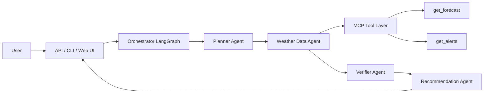
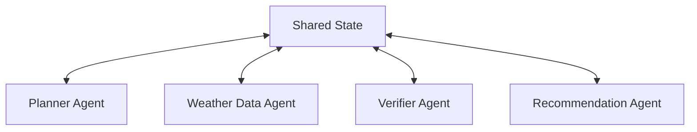

# Weather Decision Assistant PRD

Version: `v1.0`  
Status: Draft  
Owner: `lijianjun`  
Document Type: Product Requirement Document

## 1. Product Overview

### 1.1 Background
当前项目已经具备一个基础的天气 MCP Demo，核心能力是通过 MCP 暴露天气预报和天气告警查询工具。它适合作为技术验证，但如果希望进一步包装成可以写在简历中的项目，需要从“天气查询工具”升级为“面向用户决策的智能系统”。

### 1.2 Product Positioning
`Weather Decision Assistant` 是一个面向出行、活动与生活决策场景的多 Agent 天气智能助手。  
它不仅返回天气数据，还能根据地点、时间和活动类型，生成可执行的决策建议，例如：

- 明天是否适合户外跑步
- 周末是否适合露营/骑行/拍照
- 出差前应该如何准备衣物和雨具
- 当前天气是否存在高风险告警，需要调整计划

### 1.3 Product Goal
将当前天气 MCP Demo 升级为一个：

- 有明确业务场景的产品型项目
- 可展示 Multi-Agent 协作能力的 AI Demo
- 具备 MCP 工具集成、结构化状态流转和扩展能力的工程项目

## 2. Target Users

### 2.1 Primary Users
- 需要根据天气安排出行和活动的普通用户
- 希望快速获得“是否适合做某事”建议的用户

### 2.2 Secondary Users
- 面试官/技术评审者，用于观察候选人的 Agent 系统设计能力
- 开发者，用于扩展更多工具协议或业务场景

## 3. Core Scenarios

### 3.1 Scenario A: Activity Decision
用户输入：`明天下午在杭州适合骑行吗？`

系统输出：
- 天气概况
- 降水/风力/温度风险
- 活动适宜度评分
- 装备建议
- 是否建议更换时段

### 3.2 Scenario B: Trip Preparation
用户输入：`我周末去北京出差，两天怎么带衣服？`

系统输出：
- 分时天气摘要
- 最高/最低温提示
- 降雨概率提示
- 穿衣建议
- 出行提醒

### 3.3 Scenario C: Severe Weather Alert
用户输入：`加州现在有没有极端天气告警？`

系统输出：
- 告警概览
- 严重等级
- 影响区域
- 建议规避动作

## 4. Product Scope

## 4.1 In Scope for v1.0
- 支持自然语言输入天气相关决策问题
- 支持地点、时间、活动类型的基础识别
- 支持查询天气预报
- 支持查询天气告警
- 支持基于规则和 LLM 的行动建议生成
- 支持 Multi-Agent 协作执行
- 支持 MCP 作为天气工具调用协议
- 支持结构化状态在 Agent 间流转
- 提供 CLI 或简单 Web Demo 展示完整流程

## 4.2 Out of Scope for v1.0
- 长期用户记忆
- 多轮复杂任务规划
- 酒店/航班/地图等外部服务联动
- 主动通知与订阅推送
- 多租户权限管理
- 高并发生产级部署
- 复杂推荐模型或历史行为个性化

## 5. Functional Requirements

### 5.1 User Input Layer
系统需要支持以下输入类型：

- 地点型问题：`上海明天天气怎么样`
- 决策型问题：`周六去苏州跑步合适吗`
- 风险型问题：`德州现在有天气告警吗`
- 准备型问题：`后天去纽约要带伞吗`

### 5.2 Intent Parsing
系统需要识别并提取以下字段：

- `location`
- `time_range`
- `activity_type`
- `question_type`
- `risk_preference`（可选）

### 5.3 Weather Data Retrieval
系统需要通过 MCP 调用天气工具，至少支持：

- `get_forecast(latitude, longitude)`
- `get_alerts(state)`

后续可扩展工具：

- 地理编码工具
- 空气质量工具
- 历史天气工具
- 生活指数工具

### 5.4 Recommendation Generation
系统需要将天气数据转换成用户可执行建议，输出至少包括：

- 天气摘要
- 风险判断
- 活动适宜度
- 准备建议
- 备选方案

### 5.5 Result Validation
系统需要检查：

- 输入信息是否缺失
- 地点/时间是否解析失败
- 工具调用是否失败
- 建议是否与天气事实冲突

### 5.6 Output Format
建议首版统一采用结构化输出 + 自然语言摘要：

```json
{
  "intent": {
    "location": "Hangzhou",
    "time_range": "2026-04-10 afternoon",
    "activity_type": "cycling",
    "question_type": "activity_decision"
  },
  "weather_summary": {},
  "risk_assessment": {},
  "recommendation": {
    "score": 78,
    "decision": "suitable_with_caution",
    "tips": []
  }
}
```

## 6. Non-Functional Requirements

### 6.1 Fast Delivery
- 首版应优先保证链路跑通
- 避免在 v1.0 引入复杂 infra
- 优先使用成熟框架而非自研编排层

### 6.2 Extensibility
- Agent 之间通过统一状态对象交互
- MCP 工具层与 Agent 决策层解耦
- 业务场景可通过新增 Agent 或节点扩展

### 6.3 Observability
- 支持打印关键流程日志
- 可记录每个 Agent 输入、输出与工具调用结果
- 后续可接 tracing 平台

### 6.4 Reliability
- 工具调用失败要有兜底提示
- 缺失参数时要触发澄清或容错分支
- 输出中避免编造天气事实

## 7. Product Architecture

### 7.1 High-Level Architecture
推荐采用 `LangGraph + MCP + Shared State` 的架构。



### 7.2 Agent Architecture



### 7.3 Shared State Design

```json
{
  "user_query": "",
  "intent": {
    "location": "",
    "latitude": null,
    "longitude": null,
    "state_code": "",
    "time_range": "",
    "activity_type": "",
    "question_type": ""
  },
  "tool_results": {
    "forecast": null,
    "alerts": null
  },
  "assessment": {
    "weather_risk": "",
    "data_confidence": "",
    "missing_fields": []
  },
  "final_answer": {
    "summary": "",
    "decision": "",
    "tips": []
  }
}
```

## 8. Agent Responsibilities

### 8.1 Planner Agent
职责：

- 理解用户问题
- 识别地点、时间、活动、任务类型
- 决定需要调用哪些工具
- 初始化 shared state

输入：
- `user_query`

输出：
- `intent`
- `execution_plan`

### 8.2 Weather Data Agent
职责：

- 根据 Planner 结果调用天气相关 MCP 工具
- 拉取 forecast 和 alerts
- 对工具结果做基础清洗

输入：
- `intent`
- `execution_plan`

输出：
- `tool_results`

### 8.3 Verifier Agent
职责：

- 校验工具结果是否足够
- 检查是否缺失关键字段
- 检查最终建议是否存在明显矛盾

输入：
- `intent`
- `tool_results`

输出：
- `assessment`

### 8.4 Recommendation Agent
职责：

- 将天气事实转换为行动建议
- 输出适宜度结论、风险点、准备清单
- 生成用户可读的自然语言回复

输入：
- `intent`
- `tool_results`
- `assessment`

输出：
- `final_answer`

## 9. Framework Selection

### 9.1 Recommended Framework: LangGraph
选择 `LangGraph` 作为 v1.0 的 Multi-Agent 编排框架。

原因：

- 比自研工作流实现更快
- 节点、边、状态的抽象非常适合本项目
- 方便从单链路扩展到条件分支
- 易于接入工具调用和状态跟踪
- 后续扩展 memory、checkpoint、human-in-the-loop 成本低

### 9.2 Alternative Options
`AutoGen` 适合强调 agent 对话感，但对于 v1.0：

- 可控性略弱
- 状态管理不如 LangGraph 直接
- 更容易做成“会聊天的 demo”，而不是“能落地的系统”

结论：
- `v1.0` 优先选 `LangGraph`
- 后续如需更强的群聊式 Agent 交互，可评估混合模式

## 10. Communication Design

### 10.1 Recommended Communication Method
Agent 之间采用 `Shared Structured State` 进行通信，而不是自由文本对话。

### 10.2 Why
- 实现快
- 可控性强
- 便于调试
- 易于接 API 和前端
- 易于新增节点和状态字段

### 10.3 Communication Principles
- Agent 读写统一状态对象
- Tool 调用结果统一存入 `tool_results`
- 面向用户的自然语言仅在最终阶段生成
- 中间链路尽量使用结构化数据

## 11. MCP Role Design

### 11.1 Position of MCP
MCP 在本项目中不是主 Agent，而是 `Weather Data Agent` 调用外部工具的协议层。

### 11.2 Responsibilities of MCP Layer
- 统一工具注册
- 统一工具发现
- 统一参数传递
- 统一结果返回
- 屏蔽底层天气服务实现差异

### 11.3 Benefits
- 天气工具可以单独迭代
- 后续接入新的外部能力时无需改动核心 Agent 逻辑
- 有利于展示协议化工具接入能力

## 12. v1.0 MVP Definition

### 12.1 Minimal Viable Product
`v1.0` 必须完成的最小闭环：

1. 用户输入自然语言问题
2. Planner Agent 提取意图
3. Weather Data Agent 通过 MCP 获取 forecast/alerts
4. Verifier Agent 判断是否缺失数据
5. Recommendation Agent 输出最终建议
6. CLI 或简单 Web 页面展示结果

### 12.2 Success Criteria
- 能成功回答至少 3 类问题：天气概况、活动决策、告警查询
- 能展示至少 3 个 Agent 的协作链路
- 能体现 MCP 工具调用
- 输出不只是原始天气数据，而是“面向决策的建议”

## 13. Suggested Project Structure

```text
mcp-test/
├─ docs/
│  └─ prd.md
├─ weather/
│  ├─ weather.py
│  ├─ agents/
│  │  ├─ planner.py
│  │  ├─ weather_data.py
│  │  ├─ verifier.py
│  │  └─ recommender.py
│  ├─ graph/
│  │  └─ workflow.py
│  ├─ models/
│  │  └─ state.py
│  ├─ tools/
│  │  └─ mcp_client.py
│  ├─ api/
│  │  └─ app.py
│  └─ ui/
│     └─ demo.py
```


## 15. Risks and Constraints

### 15.1 Current Constraints
- 当前天气数据源偏基础
- 当前工具主要针对美国 NWS 数据
- 地理编码和非美国场景支持不足

### 15.2 Product Risks
- 用户问题可能缺少时间或地点
- 天气接口失败会影响整体链路
- 建议生成如果只靠 LLM，可能出现事实漂移

### 15.3 Mitigation
- 增加参数校验与默认策略
- 使用结构化结果约束输出
- Recommendation Agent 只在真实天气数据基础上生成建议

## 16. Roadmap

### 16.1 v1.0
- 单天气数据源
- 3 到 4 个 Agent
- MCP 工具接入
- 决策建议输出
- CLI / 简单 Web Demo

### 16.2 v1.1
- 引入地理编码工具
- 支持更多城市和国家
- 增加空气质量和生活指数
- 增加 prompt 模板和结果评分

### 16.3 v1.2
- 增加用户偏好和记忆
- 增加日历联动和提醒
- 增加更多生活场景模板
