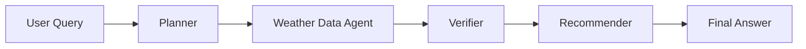

# Weather Decision Assistant Technical Design

Version: `v1.0`

## 1. Design Goal

本设计稿用于把当前 `weather.py` 的 MCP Demo 平滑演进为一个可扩展的多 Agent 项目。  
设计原则：

- 先保留现有天气工具服务，不推翻重来
- 先打通单链路工作流，再替换成正式编排框架
- Agent 层、状态层、工具层解耦
- 尽量用标准库和轻量抽象完成第一阶段骨架

## 2. Existing Reuse Strategy

当前可直接复用的模块：

- `weather/weather.py`
  作为现有 MCP 天气服务入口，继续承担 `get_forecast` 和 `get_alerts` 的工具暴露职责

演进思路：

- 不先重写 `weather.py`
- 在其上新增 `assistant/` 目录作为应用层
- 后续由 `assistant/tools/weather_mcp.py` 统一接 MCP

## 3. Target Code Structure

```text
weather/
├─ weather.py
├─ assistant/
│  ├─ agents/
│  │  ├─ planner.py
│  │  ├─ weather_data.py
│  │  ├─ verifier.py
│  │  └─ recommender.py
│  ├─ api/
│  │  └─ app.py
│  ├─ graph/
│  │  └─ workflow.py
│  ├─ models/
│  │  └─ state.py
│  └─ tools/
│     └─ weather_mcp.py
```

## 4. Layered Responsibilities

### 4.1 Tool Layer
路径：
- `assistant/tools/weather_mcp.py`

职责：
- 封装 MCP 客户端调用细节
- 提供统一方法，例如 `get_forecast()`、`get_alerts()`
- 隔离 stdio transport、协议格式、异常处理

为什么单独抽这一层：
- 后面换成 HTTP、SSE 或更多工具时不影响 Agent
- 方便做 mock 和单测

### 4.2 Model Layer
路径：
- `assistant/models/state.py`

职责：
- 定义 shared state
- 约束 Agent 输入输出
- 让工作流调试具备稳定结构

当前选型：
- `dataclass`

原因：
- v1.0 快
- 无额外依赖
- 后续若需要 API schema，可再迁移到 `pydantic`

### 4.3 Agent Layer
路径：
- `assistant/agents/*.py`

职责拆分：

- `planner.py`
  负责意图识别、问题分类、执行计划初始化

- `weather_data.py`
  负责触发天气与告警工具调用，并标准化结果

- `verifier.py`
  负责检查缺失参数、工具失败、数据完整性

- `recommender.py`
  负责输出最终自然语言建议和结构化结论

### 4.4 Workflow Layer
路径：
- `assistant/graph/workflow.py`

职责：
- 管理节点执行顺序
- 控制数据从一个 Agent 流向下一个 Agent
- 后续承接 LangGraph

当前实现策略：
- 第一阶段先用普通 Python 顺序函数
- 第二阶段替换为 `LangGraph StateGraph`

这样做的好处：
- 现在就能开始写 Agent
- 不会因为框架接入阻塞整体开发

### 4.5 API Layer
路径：
- `assistant/api/app.py`

职责：
- 作为 CLI、Web、HTTP API 的统一入口
- 接收用户 query，返回最终 state

## 5. Workflow Design

### 5.1 V1.0 Execution Flow



### 5.2 Node Input / Output

`Planner`
- Input: `user_query`
- Output: `intent`, `execution_plan`

`Weather Data Agent`
- Input: `intent`, `execution_plan`
- Output: `tool_results`, partial `assessment`

`Verifier`
- Input: current shared state
- Output: `assessment`

`Recommender`
- Input: current shared state
- Output: `final_answer`

## 6. Technology Route

### Phase 1: Skeleton First
目标：
- 完成目录拆分
- 固定 shared state
- 跑通一条空心工作流

交付：
- 当前已新增的 `assistant/` 目录骨架
- 占位 Agent 和工作流文件

### Phase 2: MCP Access Integration
目标：
- 在 `weather_mcp.py` 中实现 MCP 客户端调用
- `weather_data.py` 调用 MCP 获取 forecast 和 alerts

优先事项：
- 明确是直接进程 stdio 调用，还是由外部 client 管理 server lifecycle
- 对工具调用结果做统一格式化

建议：
- v1.0 保持一个 MCP 工具服务
- 后续新增工具也走同样适配器模式

### Phase 3: Intent Parsing Upgrade
目标：
- Planner 从简单规则升级到 LLM + 规则混合模式
- 支持提取地点、时间、活动类型

建议顺序：
- 先规则分类问题类型
- 再接一个轻量模型做结构化抽取
- 抽取结果写回 `Intent`

### Phase 4: Recommendation Logic
目标：
- 基于天气结果生成更像产品的建议

推荐拆法：
- 先写规则引擎
- 再接 LLM 做润色和解释

规则层可以先支持：
- 温度阈值
- 降雨风险
- 风力风险
- 告警优先级

### Phase 5: LangGraph Migration
目标：
- 把 `workflow.py` 从顺序调用切换为正式 graph

迁移方式：
- 保持现有 agent 函数签名不变
- 仅替换工作流组织方式

这样迁移成本最低，因为：
- Agent 已经是独立节点
- Shared state 已经存在

### Phase 6: Demo Surface
目标：
- 对外展示完整流程

建议顺序：
1. 先做 CLI
2. 再做 FastAPI 或 Streamlit
3. 最后补 tracing、日志和示意图

## 7. Recommended Implementation Order

建议按下面顺序推进：

1. 先补 `assistant/tools/weather_mcp.py` 的真实 MCP 调用
2. 再让 `weather_data.py` 能把 forecast/alerts 写入 state
3. 然后增强 `planner.py` 的字段抽取
4. 接着在 `recommender.py` 实现规则化建议
5. 最后把 `workflow.py` 迁移到 LangGraph

## 8. Interface Conventions

### 8.1 Agent Function Convention
统一函数签名：

```python
def run_xxx(state: AssistantState) -> AssistantState:
    ...
```

好处：
- 易测试
- 易挂到 graph
- 易做 tracing

### 8.2 State Update Convention
统一约束：
- Agent 不直接拼接最终 UI 文本，除 `recommender` 外
- Tool 原始结果先进入 `tool_results`
- 所有容错状态写入 `assessment`

## 9. Near-Term Risks

### 9.1 MCP Client Integration Risk
你当前项目里已有 MCP server，但 client 端还没有正式抽象。

影响：
- 这是从 demo 走向完整工作流的第一处关键实现

建议：
- 把 client 封装放在单独文件，不要散落到 agent 内

### 9.2 Geography Support Risk
当前天气工具依赖 NWS，更偏美国场景。

影响：
- 对“中文城市 + 全球地点”场景支持有限

建议：
- v1.0 文案中明确美国天气数据源
- v1.1 再加入 geocoding 和更多天气源

## 10. Definition of Done for the Next Step

下一阶段完成的标准建议定义为：

- `assistant` 工作流可以从一条 query 运行到最终 state
- MCP forecast 和 alerts 能真实写入 `tool_results`
- `planner` 至少能识别 3 类问题
- `recommender` 至少能输出 3 类用户建议模板
- CLI 演示可展示完整状态流转
